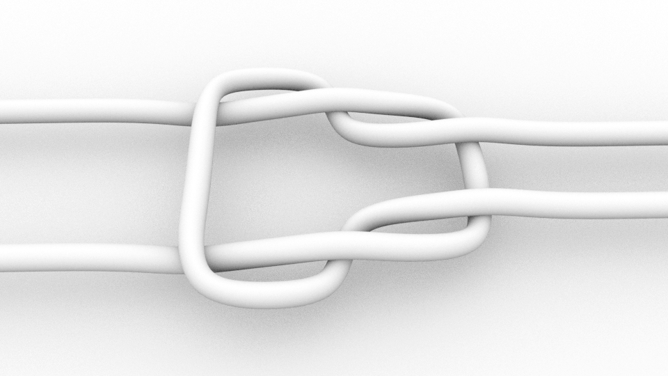
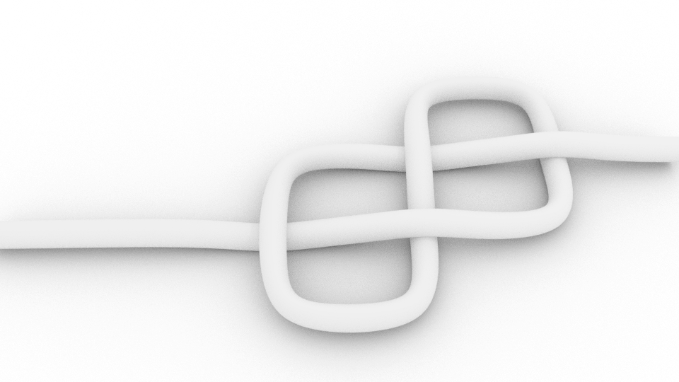

# Import ASCII knots

Blender addon for importing knots from ASCII art descriptions in [John H. Williamson's "knotation"](https://johnhw.github.io/blender_knots/index.md.html).

## What's included
* `knot_plugin.py`
* A few example .knt files.
* `physics.blend` A simple example showing the use of physics to animate a knot tightening.

## Instructions
* Download the script and install addon.
* Create a .knt (or .txt) file, or use one of the included examples, and import it.
* If the knot has multiple loose parts, separate them.
* For each of the separated parts, add a `Skin` modifier, and a `Subdivision Surface` above and below.

## Notation:

The notation is a simple ASCII art representation of the path of the rope. The rope
can go in each of the four cardinal directions, and can go beneath existing rope.

Every knot is represented as a collection of **leads**, where one a **lead** is a separate
piece of rope. A simple overhand knot only has one lead; a bend will have at least two leads, and so on.

* **lead** a connected sequence representing one physical strand of rope 
* **space** any cell without any character

* Every lead must have a **head**; either directed, undirected or numbered
* A lead may have an explicit **tail** (ending marker), either directed or undirected but this is optional

## Examples
 
### Reef knot

                 +--+
        >--------|-----+                            
                 |  +----------<
                 |     |
                 |  +---------->
        <--------|-----+
                 +--+
                 
                 
             

### Figure-Eight knot
        
        
              +--+
              |  | 
        >-----|-----+
              |  |  |
              +--|----->
                 |  |
                 +--+

             
                 
                 
### Bowline knot
        
        
              V
              |
              |
             /|-\
             \-\|
            /--||-\
            | \---/
            |  ||
            |  V|
            \---/
                        
                     

## Characters

### Leads
* `- |` connected elements of a line

        ---------

        |
        |
        |
        
        
#### Under/over
A line is assumed to continue underneath if it disappears without a corner symbol:
    
    
        V                   V
        |                   |
    >---|---             >------
        |                   |
    
    
This may continue for any number of steps:
    
         VVV
         |||
    >----|||----
         |||
         |||

                          

### Corners         
#### Undirected
* `+` undirected corner

  Indicates a change of direction. Must be unambiguous when following the path of the lines
  
  
      >----+
           |
           +----

                 |
       >--------++-<
                |

        NOT OK:

                  |
            >-----+
                  |

                            
#### Directed
* `/ \` directed corner; Can be used to explicitly annotate direction of corner

                 |
                 |
        >--------/       >----\
                              |
                 
        
### Heads/tails
#### Directed
* `^ v > <` Directed head

Indicates head of a lead, if facing a lead, or the tail if facing whitespace

        >---

        --->

        V
        |
        |
        V
    
#### Undirected 
* `[0-9]` undirected head

Indicates start of a lead. Labels a lead with the given number. Only one digit permitted. Must neighbour exactly one line cell so that direction is indicated.

        0---

        0
        |
        |
        

* `.` Undirected tail (optional)

        ---.

        |
        |
        .
        
## Comments/names
* `[name]` names a line

May appear anywhere on the line excluding the end, including before the leader or in place of the leader. Always read left to right, regardless of line orientation. The lead must pass through the name to take effect.  Can be used as a comment if not adjacent to a lead.

The Blender script does not use the names for anything at the moment.

    [a comment; this --- is ignored]
    
               V
               |
    [this has a lead through it and will name the lead]
               |
               .
                           
    
            >[left]---> <---[right]<

            0
            |
            |
         [left]
            |
            |
            V

